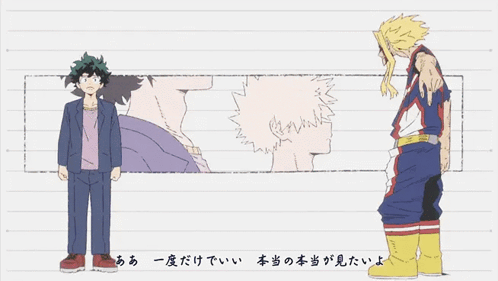
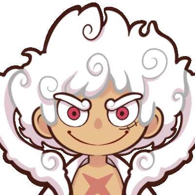

<!-- ===== Anime Banner (upload ./assets/banner.gif) ===== -->

  

<h1 align="center">✨ Kon'nichiwa! I'm <b>SHAIK SADIK</b> 🚀</h1>

  

<em>Anime-Themed Developer • Web Developer • CSE Student</em>

---

## 👋 Introduction
I'm a Computer Science & Engineering student at KL University who builds playful, aesthetic web experiences 🎌  
I blend **logic + design** to create interactive, cute, and smooth websites.

---

## 🏮 About Me
- 🎓 CSE Student — KL University  
- 💡 I build smart, playful, and aesthetic web experiences  
- 💻 Passionate about Web Development (Frontend + Node.js)  
- ⚡ I love blending logic + design to make fun & functional projects  
- 📄 **Download My Resume:** [SHAIK.SADIK-RESUME.pdf](./CV/SHAIK.SADIK-RESUME.pdf)

---

## 🛠️ Tech Stack

**Frontend:** HTML · CSS · JavaScript · React  
**Backend:** Node.js  
**Database:** MySQL  
**Tools:** Git · GitHub

  

---

## 🧠 Soft Skills
- Teamwork · Problem-solving · Creativity · Communication · Adaptability

---

## 🏆 Certifications
*(Click the certificate name to open the PDF inside this repo)*

| Certificate | Link |
|---|---|
| MultiCloudNetwork | [View PDF](./cirtificates/MultiCloudNetwork.pdf) |
| Oracle AI Foundations | [View PDF](./cirtificates/oracle-eCertificate-AI%20Fundatio....pdf) |
| Salesforce | [View PDF](./cirtificates/salseforce.pdf) |
| Linguaskill Business English (Cambridge) | [View PDF](./cirtificates/Sadik%20Shaik.pdf) |

---

## 🚀 Projects

### 🔹 **Online Art Gallery**  
Small, aesthetic gallery app for browsing and purchasing artworks — nice animations, responsive UI.  
🔗 Repo: https://github.com/sadikshaik01/OnlineArtGallery-Project

### 🔹 **News Aggregator**  
Full-stack news app that fetches and categorizes latest news with a clean UI.  
🔗 Repo: https://github.com/sadikshaik01/News-Aggregator-project

### 🔹 **JobPortel**  
Job listing portal with filters and application flow.  
🔗 Repo: https://github.com/sadikshaik01/JobPortel

---

## 🌐 Connect With Me

  
  &nbsp;
  
  &nbsp;
  

---

## 📊 GitHub Stats & Languages

  <!-- Main stats card -->
  
  &nbsp;&nbsp;
  <!-- Top languages: increased langs_count for better coverage -->
  

  <!-- Streak / activity -->
  

  <!-- Fallback: if top-langs is blank, this small badge shows primary language using shields -->
  

---

## ⚡ Fun Fact (Slayercore Vibes)
I build websites that look like they came straight out of a anime World 🎨✨ — interactive, cute, smooth, and full of personality!

  <!-- use gif1 + gif2 as decorative looping content -->
  
 

---

## 🎌 Closing GIF (Luffy hype)

  

<strong>Thanks for visiting my profile — have a great day! ✨</strong>

